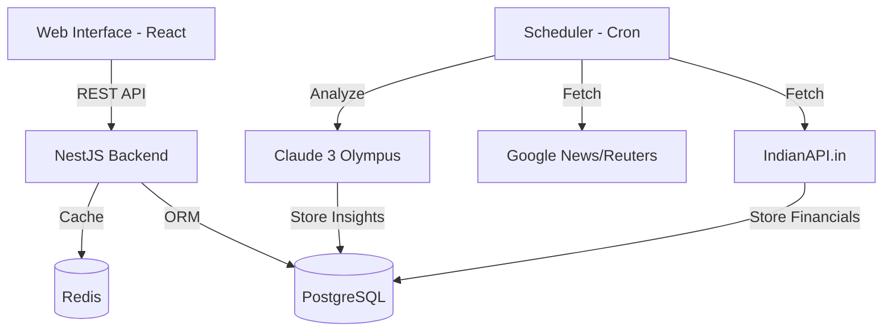

# LOONDX Terminal Architecture

The LOONDX Terminal is a real-time financial intelligence platform built for high-performance stock analysis and AI-driven market sentiment.

## System Overview

## Core Layers

### 1. Market Data Layer
- **Source**: IndianAPI.in
- **Function**: Ingests real-time prices, historical candle data, and quarterly financial statements.
- **Frequency**: 1-5 minutes for prices; Quarterly for financials.

### 2. AI Intelligence Layer (Claude 3.5/Opus)
- **Engine**: Anthropic Claude API.
- **Impact Engine**: Maps global events (e.g., War, Interest Rates) to specific sector and stock impacts.
- **Precomputation**: AI summaries are generated every 6–12 hours to minimize latency and costs.

### 3. Social Sentiment Layer
- Scrapes/Aggregates sentiment from X (Twitter) and Reddit.
- Classified into Bullish/Bearish/Neutral scores by the AI service.

### 4. Macro & Institutional Layer
- Monitors global signals (Crude Oil, USD/INR, Treasury Yields).
- Tracks Institutional (FII/DII) net flows to identify smart money movement.

## Data Flow
1. **Ingestion**: Scheduled jobs fetch data from external APIs.
2. **Processing**: AI evaluates raw news and financials.
3. **Storage**: All structured data and AI summaries are stored in PostgreSQL via Prisma.
4. **Consumption**: The frontend React app fetches the precomputed "Intelligence Package" for each stock.
