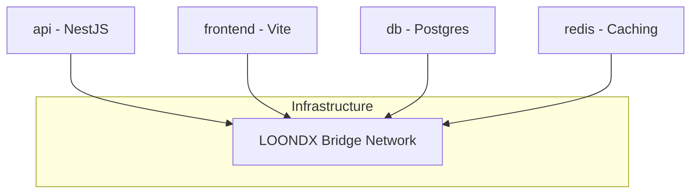

# Docker & Deployment Best Practices

## 1. Container Strategy
LOONDX Terminal uses **Docker Compose** to orchestrate four distinct layers. This ensures environment parity between development and production.

## 2. Best Practices Implemented

### 🚀 Production Optimization
- **Multistage Builds**: The `Dockerfile`s (to be refined) should use multistage builds to separate the "Build" environment from the "Runtime" environment, keeping production images ~80% smaller.
- **Node Environment**: Always set `NODE_ENV=production` in production containers to enable NestJS/React performance optimizations.

### 🔐 Security & Configuration
- **Environment Separation**: sensitive keys (`ANTHROPIC_API_KEY`, `INDIAN_API_KEY`) are *never* hardcoded. They are passed as secrets or via `.env` files which are ignored by Git.
- **Non-Root User**: Production images should run as a non-privileged `node` user instead of `root`.

### ⚡ Persistence & Networking
- **Volume Mapping**: Database data is mapped to a named volume (`postgres_data`) so that database state persists even if the container is destroyed or updated.
- **Internal Aliasing**: The frontend communicates with the backend via a service name alias (e.g., `http://api:3000`) within the Docker network, keeping traffic internal.

## 3. Maintenance Commands

| Action | Command |
| :--- | :--- |
| **Start Stack** | `docker-compose up -d` |
| **Full Cleanup** | `docker-compose down -v` (Careful: deletes DB data) |
| **View API Logs** | `docker-compose logs -f api` |
| **Prisma Update** | `docker-compose exec api npx prisma db push` |

## 4. Scaling Strategy
For high traffic, the **api** service can be scaled horizontally using `docker-compose up --scale api=3`, with a load balancer like Nginx in front. Since the AI insights are precomputed in the database, adding more API instances immediately increases throughput.
