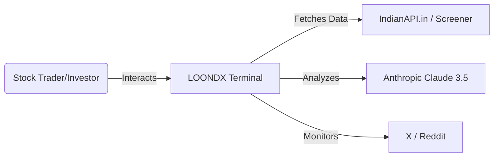
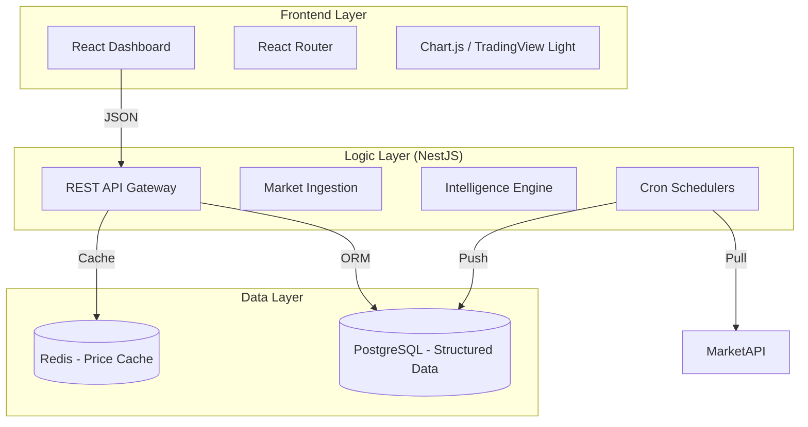

# High-Level Design (HLD) - LOONDX Terminal

## 1. System Philosophy
LOONDX Terminal is designed as a **data-heavy, low-latency intelligence platform**. It shifts the heavy lifting (AI analysis and data normalization) to the backend background processes so the user experiences an "instant-on" financial terminal.

## 2. System Context (C4 Model - Level 1)

## 3. High-Level Architecture (Level 2)
The platform is composed of four primary containers, orchestrated via Docker.

## 4. Key Performance Strategies
- **Database-First Intelligence**: We never make an AI call while a user is waiting. All AI insights are precomputed and cached.
- **Micro-Updates**: Only high-frequency data (Price) is polled frequently. Deep analysis is refreshed on a 6-12 hour cycle.
- **State Hydration**: On startup, the UI hydrates from a single "Intelligence Package" reducing the number of round-trips to the server.
