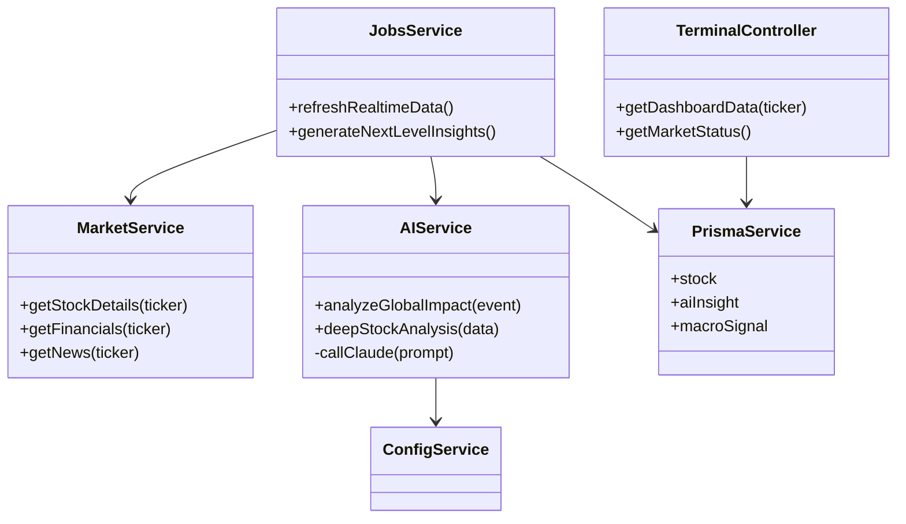
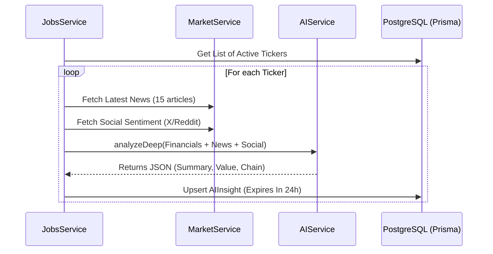

# Low-Level Design (LLD) - LOONDX Terminal

## 1. Class Diagram (Backend Services)

## 2. Sequence Diagram: AI Insight Generation
This describes the background process that runs every 6-12 hours.

## 3. Data Schema Details
- **Stock Model**: Central hub. Stores normalization of external metrics (PE, ROE, FCF).
- **Impact Chain String**: A serialized representation of global events. Example: `War -> Oil -> Logistics -> Margins`.
- **PrecomputedAt**: Every insight is timestamped to ensure the UI can show "Analysis fresh as of X hours ago".

## 4. Error Handling & Circuit Breaking
- **Market API Failure**: Jobs service catches errors and logs them. The DB retains the *last known good data*.
- **AI API Failure**: If Claude is down, the system generates a "Limited Analysis" fallback from basic financial ratios in the database.
