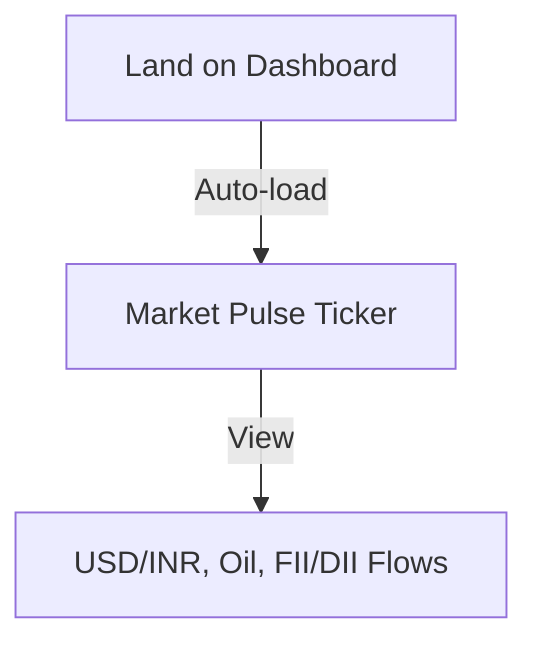
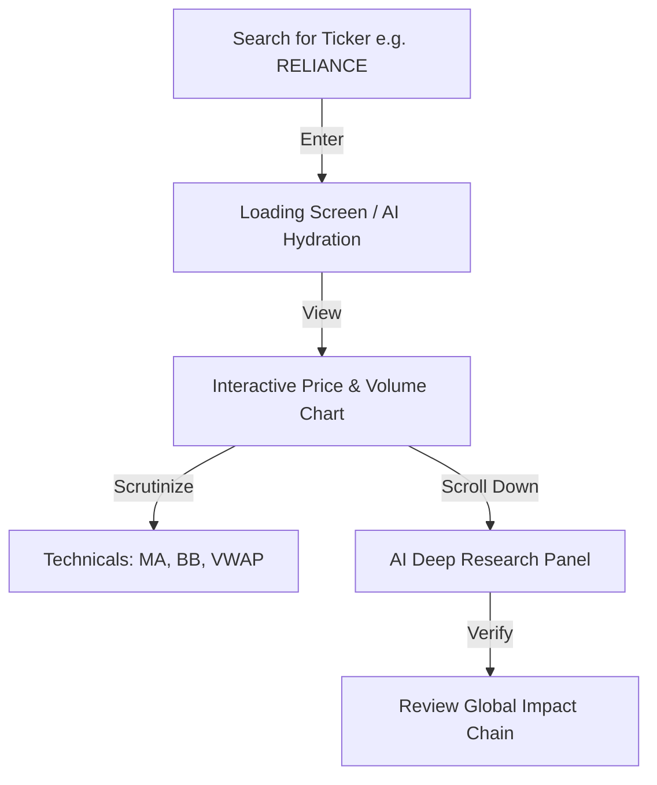
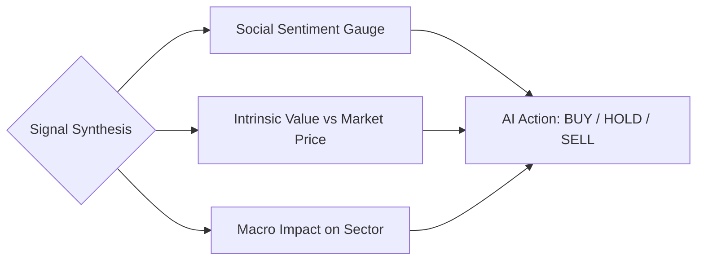

# User Journey - LOONDX Terminal

## 1. Discovery & Onboarding
The user lands on the terminal with a high-level overview of the Indian market.

## 2. Stock Investigation Flow
The primary workflow for a trader or researcher.

## 3. Deep Research & Decision Making
How the user decides to act based on multiple signals.

## 4. Interaction Archetypes
- **The Scalper**: Stays in the main chart area, toggling 1D/5D timeframes and using the sidebar "Live Pulse" for sentiment shifts.
- **The Value Investor**: Focuses on the "Valuation / DCF" panel and the "AI Deep Research" summary to find entries below intrinsic value.
- **The Macro Analyst**: Primarily watches the top ticker and the "Global Impact Chain" to predict sector-wide movements.
